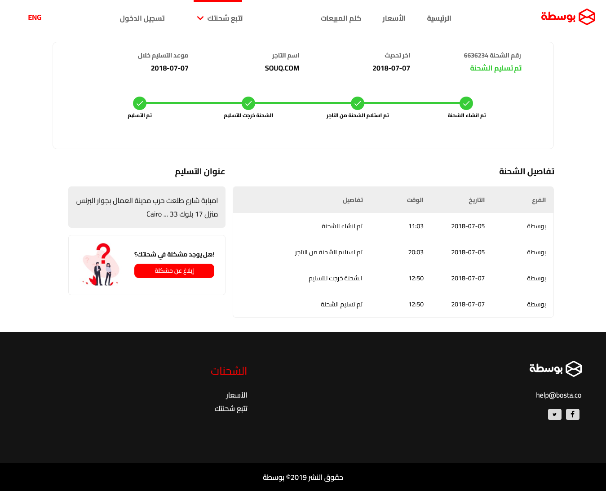

# 🚛 Bosta - A shipment tracking react app.

This is a solution to the technical assessment of [Bosta courier services provider](https://bosta.co/). 

## Table of contents

- [Overview](#overview)
  - [Screenshot](#screenshot)
  - [The challenge](#the-challenge)
  - [Links](#links)
- [My process](#my-process)
  - [Built with](#built-with)
- [Author](#author)

## Overview

### Screenshot

### The challenge

- Use our Bosta Shipment tracking GET request [here](https://tracking.bosta.co/shipments/track/:trackingNumber).
- tracking number to be used: (6636234, 7234258, 9442984,1094442 ).
- Create a react app that similar to our website tracking service [currently HTML on bosta.co](https://bosta.co/tracking-shipment/?lang=en&track_num=6636234).
- Call the API and handle the response in a [similar UI like the attached here](https://github.com/the-goat7/Bosta/tree/main/src/assets/design%20files).
- Build the UI completely responsive and use a UI assets similar to the ones inside these images.
- Data returned in the API is strings in english, please map it to Arabic with any way you think it will be better.
- Use font name: Cairo (search for it) and make the font weight adjustment similar to the shown below.

**Note: Please assume any missing data and imagine in the UI.**

### Links

- Solution URL: [Bosta Shipment tracking app](https://bosta-tracking-app.netlify.app/)

## My process

### Built with

- [React](https://reactjs.org/) - JS library
- [React-i18next](https://react.i18next.com/) - For translation.
- [React-icons](https://react-icons.github.io/react-icons/icons?name=md) - For Material Design icons.
- [Styled Components](https://styled-components.com/) - For styles
- [Axios](https://axios-http.com/) - For making HTTP requests.

## Author

- Portfolio - [Shaher Ashraf](https://thegoat7.netlify.app/)
- Linked In - [Shaher Ashraf](https://www.linkedin.com/in/shaher88223/)
